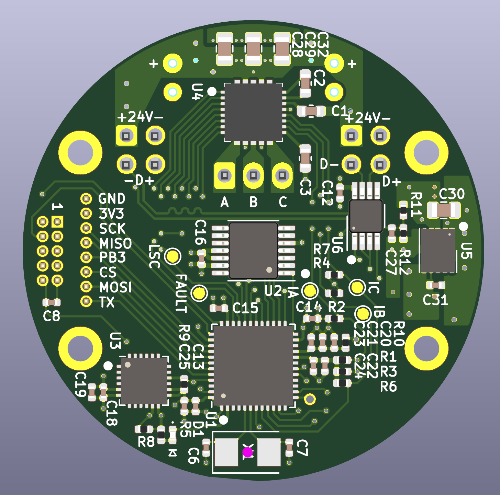

# Summary

Betz Mini is a 40mm diameter circular circuit board. It can drive low-power
brushless motors with up to around 24 volts DC and 3 amps.

# Features

 * STM32G474 microcontroller
 * MP6540 motor driver
 * AS5047U magnetic encoder
 * THVD2450 RS-485 transceiver
 * IIS328DQ accelerometer
 * Molex Nano-Fit connectors, within the PCB outline
 * Four mounting holes for M2 screws
 * Bonus header with an extra SPI bus (remote encoder, etc.)

# Schematics

Everything is done in KiCAD. A PDF export of the schematics [can be downloaded here.](https://github.com/codebot/betz_experimental/raw/master/hardware/betz_mini/betz_mini.pdf)

# Renderings

