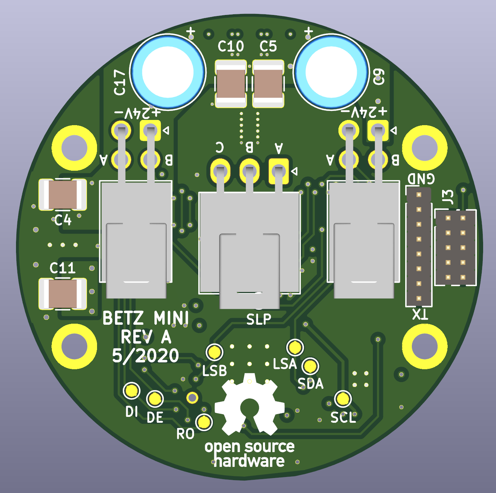

# Summary

Betz Mini is a 40mm diameter circular circuit board. It can drive low-power
brushless motors with up to around 24 volts DC and 3 amps.

# Features

 * STM32G474 microcontroller
   * ARM Cortex M4 at 170 MHz
   * 512 KB flash
   * 128 KB RAM
   * CORDIC accelerator (trig functions, etc.)
   * 5 ADC's
   * SPI, UARTs, timers, all the usual bells and whistles
 * MP6540 brushless motor driver
   * internal gate drivers and power stage
   * internal current-sense amplifiers across low-side FETs
 * AS5047U magnetic encoder
   * 14-bit magnetic angle sensing
   * built-in velocity estimation
 * THVD2450 RS-485 transceiver
   * rated up to 20 Mbit
 * IIS328DQ accelerometer
   * intended for industrial applications (shock resistant)
 * Molex Nano-Fit connectors, within the PCB outline
   * 2.5mm pitch
   * locking latch
   * backout-prevention clips can be installed
   * hand-crimpable
 * Four mounting holes for M2 screws
 * Bonus header with unused MCU pins
   * SPI bus to support a remote encoder board
   * UART for console `printf()`

# Schematics

Everything is done in KiCAD. A PDF export of the schematics [can be downloaded here.](https://github.com/codebot/betz_experimental/raw/master/hardware/betz_mini/betz_mini.pdf)

# Renderings

