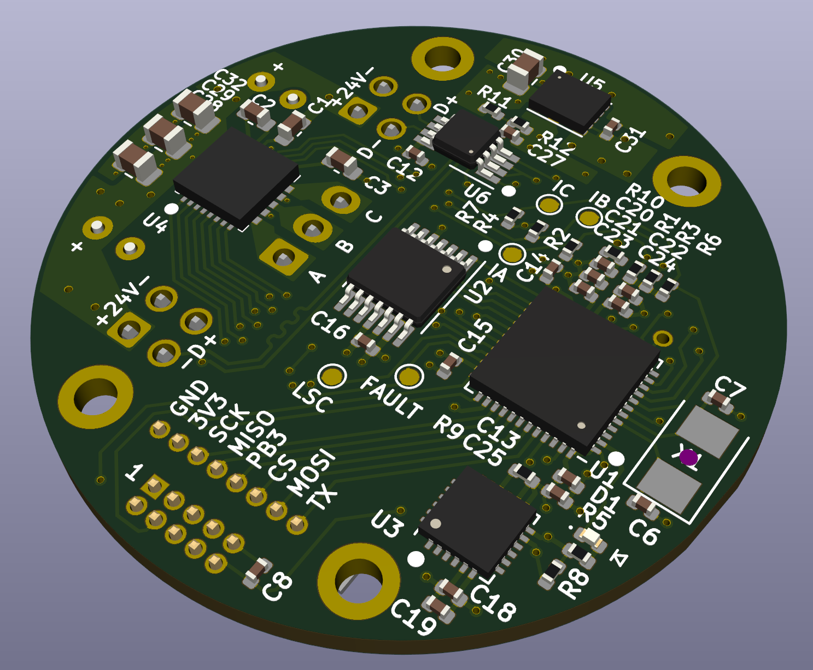
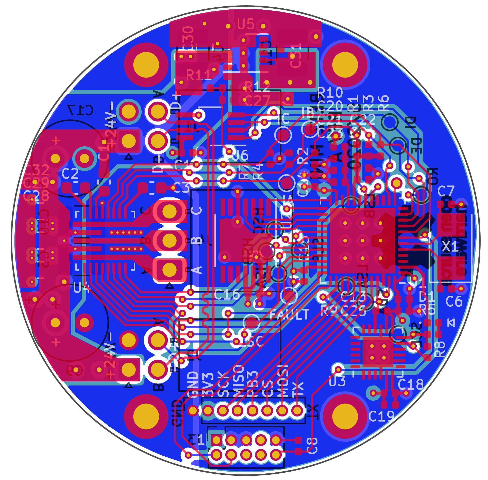

# Summary

Betz Mini is a 40mm diameter circular circuit board. It can drive low-power
brushless motors with up to around 24 volts DC and 3 amps.

# Features

 * [STM32G474](https://www.st.com/content/st_com/en/products/microcontrollers-microprocessors/stm32-32-bit-arm-cortex-mcus/stm32-mainstream-mcus/stm32g4-series/stm32g4x4.html) microcontroller
   * ARM Cortex M4F at 170 MHz
   * 512 KB flash
   * 128 KB RAM
   * CORDIC accelerator (trig functions, etc.)
   * 5 ADC's
   * SPI's, I2C's, UARTs, elite timers, DMA, all the usual bells and whistles
 * [MP6540](https://www.monolithicpower.com/en/mp6540-mp6540a.html) brushless motor driver
   * internal gate drivers and power stage
   * internal current-sense amplifiers across low-side FETs
 * [AS5047U](https://ams.com/as5047u) magnetic encoder
   * 14-bit magnetic angle sensing
   * built-in velocity estimation
 * [THVD2450](http://www.ti.com/product/THVD2450) RS-485 transceiver
   * rated to 50 Mbit
 * [IIS328DQ](https://www.st.com/en/mems-and-sensors/iis328dq.html) accelerometer
   * intended for industrial applications (shock resistant)
 * [Molex Nano-Fit](https://www.molex.com/molex/products/family/nanofit_power_connectors) connectors
   * 2.5mm pitch
   * rated to 6.5 amps
   * locking latch
   * fully isolated, shrouded, and keyed
   * backout-prevention clips
   * hand-crimpable
   * headers and receptacles fit within PCB outline
 * Four mounting holes for M2 screws
 * Bonus header with unused MCU pins
   * SPI bus to support a remote encoder board
   * UART for console `printf()`
   * one analog-capable pin

# Schematics

KiCAD. A PDF export of the schematics [can be downloaded here.](https://github.com/codebot/betz_experimental/raw/master/hardware/betz_mini/betz_mini.pdf)

# Layout

KiCAD. The layout file is in the parent directory.

# Renderings

